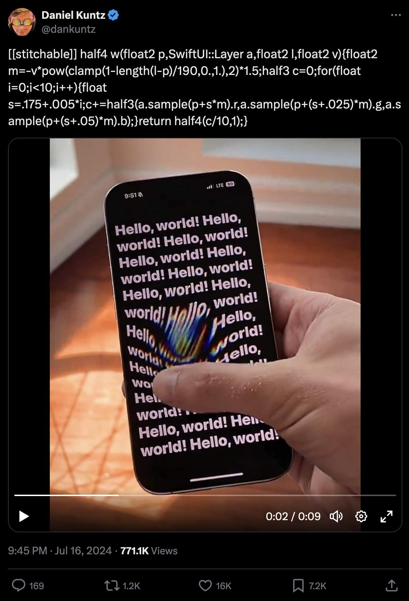

# doggowarp

This is a toy project to imitate the
[really cool RGB-split drag effect](https://x.com/dankuntz/status/1813283813881225625)
by [@dankuntz](https://x.com/dankuntz), and an excuse to play in Rust a little.




The original is implemented with SwiftUI, whereas I attempted
it in Rust using `winit` and `pixels`. To parallelize pixel
operations, I used `rayon`'s parallel iterators.

There are many helper types and functions, because I wanted to replicate the
main business logic in a single function and push additional complexity out of
the 'shader' function. I wanted this part to be directly comparable to the code
in the original tweet.

```rust
fn shader(a: &Image, p: Pos, l: Pos, v: Pos) -> Color {
    let m = 1.0 - l.dist(p) / 190.0;
    let m = m.clamp(0.0, 1.0);
    let m = v * m * m * -1.5;

    let mut c = Color::default();
    for j in 0..10 {
        let s = j as f64 * 0.005;
        c = c + Color::new(
            a.sample(p + m * (s + 0.175)).red(),
            a.sample(p + m * (s + 0.200)).green(),
            a.sample(p + m * (s + 0.225)).blue(),
        );
    }
    c * 0.1
}
```

Despite the code running on the CPU, `rayon` helps push the FPS to above 100 in my machine.

I won't bother to convert this to an actual shader. Also, the `sample()` function only performs nearest pixel.
